```mermaid
flowchart TD
    subgraph Triggers
        PR[Pull Request]
        Push[Push to main/master/develop]
        Tag[Tag v*.*.*]
        Cron[Weekly Schedule]
        Manual[Manual Dispatch]
    end

    subgraph "CI Pipeline (.github/workflows/ci.yml)"
        J1[Lint & Code Style]
        J2[Frontend Typecheck & Build]
        J3[Backend Vitest & Typecheck]
        J4[Hardhat ERC-3643 Compile & Test]
        J5[Docker Buildx & Smoke Test]
        Gate[CI Gate Status Check]

        J1 --> Gate
        J2 --> Gate
        J3 --> Gate
        J4 --> Gate
        J5 --> Gate
    end

    subgraph "Security Pipeline (.github/workflows/security.yml)"
        S1[npm audit]
        S2[GitHub CodeQL SAST]
        S3[Aqua Security Trivy Container Scan]
    end

    subgraph "CD Release (.github/workflows/cd-publish.yml)"
        CD1[Build Multi-stage Docker Image]
        CD2[Publish to GitHub Container Registry]
    end

    subgraph "Contract Deployment (.github/workflows/contracts-deploy.yml)"
        D1[Compile & Run Preflight Tests]
        D2[Deploy to Sepolia / Localnet]
        D3[Archive Deployment Artifacts]
    end

    PR --> J1 & J2 & J3 & J4 & J5
    Push --> J1 & J2 & J3 & J4 & J5
    Push --> CD1
    Tag --> CD1
    Cron --> S1 & S2 & S3
    Manual --> D1
```

# Real Estate Tokenization — CI/CD Pipeline Documentation

This document describes the automated Continuous Integration and Continuous Delivery (CI/CD) pipelines configured for the **Real Estate Tokenization (RWA) Platform** via GitHub Actions.

---

## 🏛️ Pipeline Architecture

The platform uses 4 dedicated, decoupled GitHub Actions workflows located in `.github/workflows/`:

```
.github/workflows/
├── ci.yml                 # Main Continuous Integration pipeline & Quality Gate
├── security.yml           # Automated Security SAST & Container vulnerability scans
├── cd-publish.yml         # Container image builder & GHCR deployment publisher
└── contracts-deploy.yml   # ERC-3643 smart contract deployment & verification
```



---

## 1. Continuous Integration (`ci.yml`)

### Triggers & Concurrency
- **Triggers**: Pushes and Pull Requests targeting `main`, `master`, and `develop`.
- **Concurrency**: `cancel-in-progress: true` guarantees outdated commits in a branch are immediately terminated, saving compute minutes.

### Jobs & Gates
| Job Name | Path / Context | Purpose |
| :--- | :--- | :--- |
| **`lint`** | Root | Runs ESLint (`npm run lint`) to maintain code quality across frontend, backend, and scripts. |
| **`frontend`** | Root | Validates TypeScript typing (`npm run typecheck`), creates production bundle (`npm run build`), and saves `dist/` as a build artifact. |
| **`backend`** | `backend/` | Validates backend TypeScript (`npm run typecheck`), executes the Vitest suite covering Off-chain pipeline, Integration Gates, PQC cryptography (ML-DSA-87, ML-KEM-1024), and Token Economics. |
| **`contracts`** | `contracts/` | Compiles Solidity contracts (0.8.17 / 0.8.20) with Hardhat and runs the complete ERC-3643 (T-REX) compliance test suite with MockUSDC. |
| **`docker-smoke`** | Root (`Dockerfile`) | Compiles multi-stage production image using Buildx and GitHub Actions cache (`type=gha`), spins up container, verifies HTTP 200 on `/health/live`, and asserts non-root execution (`rwa` user). |
| **`ci-gate`** | All jobs | Unified aggregation check that fails if any job fails or is cancelled. This is the **primary check** to configure in GitHub branch protection. |

---

## 2. Security & Vulnerability Scanning (`security.yml`)

### Triggers
- Weekly schedule on Monday at 04:00 UTC (`cron: "0 4 * * 1"`).
- On pushes and pull requests to `main` and `master`.
- Manual trigger via `workflow_dispatch`.

### Capabilities
- **Dependency Audit**: Inspects `package.json` and lockfiles across root, backend, and contracts for high/critical security advisories via `npm audit`.
- **CodeQL Analysis**: Static Application Security Testing (SAST) targeting JavaScript/TypeScript code to detect injection vulnerabilities, weak cryptographic usages, and tainted data flow.
- **Trivy Container Scan**: Scans the production Docker image against Aqua Security's vulnerability database and automatically uploads SARIF reports to the GitHub repository **Security > Code scanning** tab.

---

## 3. Container Continuous Delivery (`cd-publish.yml`)

### Triggers
- Push to `main` or `master`.
- Version tags formatted as `v*.*.*` (e.g. `v1.0.0`).
- Manual trigger via `workflow_dispatch` with environment selection (`staging` or `production`).

### Behavior
1. Authenticates to **GitHub Container Registry (`ghcr.io`)** via `${{ secrets.GITHUB_TOKEN }}` (no external credentials required).
2. Generates semantic tags using `docker/metadata-action`:
   - `latest` (on main/master)
   - Semantic versions (e.g., `v1.0.0`, `1.0`)
   - Git commit SHA (e.g., `sha-a1b2c3d`)
3. Builds and pushes the multi-stage image using Docker Buildx and GitHub Actions cache (`type=gha,mode=max`).
4. Generates an execution summary in the GitHub Actions dashboard with image digests and pull commands:
   ```bash
   docker pull ghcr.io/<owner>/<repo>:latest
   ```

---

## 4. Smart Contract Deployment (`contracts-deploy.yml`)

### Triggers
- Triggered manually on demand via **Actions > Deploy Smart Contracts > Run workflow**.
- Configurable inputs:
  - **`network`**: `sepolia` (default) or `localhost`
  - **`dry_run`**: Set to `true` to compile and run tests without broadcasting transactions.
  - **`token_symbol`**: Custom token symbol (defaults to `RWAT`).
  - **`fmv_usd`**: Asset Fair Market Value in USD (defaults to `$3,000,000`).

### Secrets Required for Deployment
Set the following secrets in **Settings > Secrets and variables > Actions**:

| Secret Name | Description | Mandatory For |
| :--- | :--- | :--- |
| `DEPLOYER_PRIVATE_KEY` | Hex private key of deployer wallet (funded with Sepolia ETH) | Live Sepolia deployment |
| `SEPOLIA_RPC_URL` | Sepolia RPC endpoint (Alchemy / Infura / QuickNode) | Live Sepolia deployment |
| `ETHERSCAN_API_KEY` | Etherscan API key for contract source verification | Automated verification |

Deployments automatically persist generated deployment metadata (`contracts/deployments/*-infrastructure.json`) as a downloadable workflow artifact.

---

## 🛡️ Recommended GitHub Branch Protection Settings

To ensure no broken or insecure code enters the production branches:

1. Navigate to **Settings > Branches > Branch protection rules** for `main` (and `develop`).
2. Enable:
   - **Require a pull request before merging**
   - **Require status checks to pass before merging**
   - Search and select **`CI Gate`** (from `.github/workflows/ci.yml`)
   - **Require branches to be up to date before merging**
   - **Require linear history** (optional, recommended)

---

## 💻 Running Equivalent Checks Locally

Before pushing code or opening a PR, developers can run all pipeline checks locally:

```bash
# 1. Code Quality & Linting
npm run lint

# 2. Frontend Validation
npm run typecheck
npm run build

# 3. Backend Validation & PQC Test Suites
npm run typecheck:backend
npm run test:backend

# 4. Smart Contracts Validation (Hardhat ERC-3643)
npm run contracts:compile
npm run contracts:test

# 5. Full Production Check Script
npm run prod:check

# 6. Docker Container Verification
docker build -t rwa-platform:local .
docker run -d --name rwa-test -p 3001:3001 rwa-platform:local
curl http://localhost:3001/health/live
docker stop rwa-test && docker rm rwa-test
```
