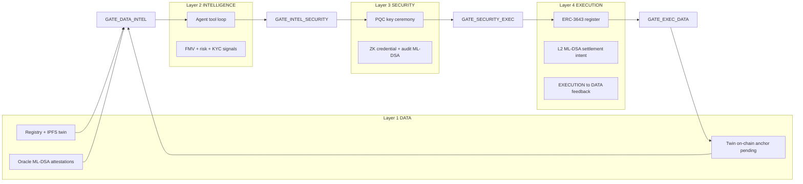

# Sepolia Testnet — Complete Backend Layer & Environment Runbook

Base URL (local): **`http://localhost:3001`**

All authenticated routes need: **`Authorization: Bearer <Supabase JWT>`** (sign in via Supabase Auth; backend validates with `SUPABASE_SERVICE_ROLE_KEY`).

---

## 1. How the four layers connect



| Layer | Code | Orchestrator | Persists to Supabase |
|-------|------|--------------|----------------------|
| **1 — Data** | `src/lib/layers/DataLayer.ts` | `DataLayerOrchestrator` | `physical_assets`, `digital_twins`, `oracle_attestations`, `twin_on_chain_anchors` |
| **2 — Intelligence** | `IntelligenceAgentService` + tools | `PipelineService.processIntelligence` | `valuations`, `risk_scores`, `intelligence_agent_runs`, `intelligence_agent_steps` |
| **3 — Security** | `src/lib/layers/SecurityLayer.ts` | `PipelineService.processSecurityForInvestor` | `crypto_keys`, `zk_credentials`, `kyc_records`, `audit_events`, `accreditation_checks` |
| **4 — Execution** | `ExecutionService` | `PipelineService.processExecution` | `security_tokens`, `layer_boundaries`, twin `schema.onChain` |

**Single entry for all layers:** `POST /api/assets/pipeline` → `PipelineService.runFullPipeline()`.

---

## 2. Required vs optional environment variables

### 2.1 Must have (Sepolia E2E will not start without these)

| Variable | File | Example / where to get |
|----------|------|-------------------------|
| `SUPABASE_URL` | `backend/.env` | Supabase → Project Settings → API |
| `SUPABASE_SERVICE_ROLE_KEY` | `backend/.env` | Same (service role — server only) |
| `SUPABASE_ANON_KEY` | `backend/.env` | Same (anon key — JWT validation) |
| `ALLOW_TOKEN_ECONOMICS_APPLY` | `backend/.env` | `true` |
| `RWA_NETWORK_PROFILE` | `backend/.env` | `testnet` |

**Database:** apply migrations `001`–`005`:

```bash
supabase db push
# or link project: supabase link && supabase db push
```

### 2.2 Required for on-chain Sepolia linkage (execution layer)

| Variable | File | Notes |
|----------|------|--------|
| `DEPLOYER_PRIVATE_KEY` | `contracts/.env` | Wallet with Sepolia ETH |
| `SEPOLIA_RPC_URL` | `contracts/.env` + optional `backend/.env` | e.g. `https://ethereum-sepolia-rpc.publicnode.com` |
| Deploy output | `contracts/deployments/sepolia.json` | Created by `npm run deploy:sepolia` |

Backend reads deployment automatically from:

`contracts/deployments/sepolia.json` (override with `CHAIN_DEPLOYMENT_FILE` if needed).

### 2.3 Strongly recommended for testnet (not strictly required — fixtures used if empty)

| Variable | Purpose |
|----------|---------|
| `INTELLIGENCE_AUTO_APPROVE` | `true` — full pipeline does not stop for human approve |
| `INTELLIGENCE_REQUIRE_HUMAN_APPROVAL` | `false` on testnet |
| `CORS_ORIGIN` | `http://localhost:5173` if using Vite frontend |

### 2.4 Optional — live integrations (testnet uses fixtures when unset)

| Variable | Service | Live URL pattern (when you wire production) |
|----------|---------|---------------------------------------------|
| `PINATA_JWT` or `PINATA_API_KEY` | IPFS twin pin | `https://api.pinata.cloud/pinning/pinJSONToIPFS` |
| `IPFS_GATEWAY` | Read CIDs | `https://gateway.pinata.cloud/ipfs/` |
| `CHAINLINK_API_KEY` | Oracle | + `CHAINLINK_VALUATION_URL` |
| `PYTH_API_KEY` | Oracle | + `PYTH_VALUATION_URL` (default Hermes) |
| `MLS_API_URL` | Comps | Your MLS/comps API base |
| `HM_LAND_REGISTRY_URL` | UK registry | Your registry REST base |
| `TORRENS_API_URL` | AU registry | |
| `CADASTER_API_URL` | EU registry | |
| `ACCREDITATION_REGISTRY_URL` | Investor accreditation | |
| `OPENAI_API_KEY` | Agent LLM summary | `OPENAI_BASE_URL` default `https://api.openai.com/v1` |
| `SUMSUB_APP_TOKEN` / `SUMSUB_WEBHOOK_SECRET` | KYC webhook | Sumsub dashboard |
| `PQC_PLATFORM_SEED` / `PQC_ORACLE_SEED` | Stable PQC keys | 64-char hex from HSM (optional dev) |

### 2.5 Flags (testnet defaults)

| Variable | Testnet value | Effect |
|----------|---------------|--------|
| `ALLOW_SMART_CONTRACT_DEPLOY` | `false` (default) | API returns deploy **instructions** only; you deploy via Hardhat |
| `ALLOW_MAINNET_DEPLOY` | `false` | Blocks `network: mainnet` |
| `ALLOW_SMART_CONTRACT_DEPLOY` | `true` | Enables `POST /api/execution/deploy-request` body with `userConfirmedDeploy: true` |

---

## 3. External URLs & services

| Service | URL / endpoint | Used by |
|---------|----------------|---------|
| **Backend API** | `http://localhost:3001` | Frontend `VITE_API_BASE_URL` |
| **Supabase REST/Auth** | `https://<project>.supabase.co` | DB + JWT |
| **Sepolia RPC** | `SEPOLIA_RPC_URL` | Hardhat deploy + optional reads |
| **Sepolia chainId** | `11155111` | L2 settlement intents |
| **Pinata** | `https://api.pinata.cloud` | Twin IPFS pin |
| **Pinata gateway** | `https://gateway.pinata.cloud` | CID preview |
| **OpenAI** (optional) | `https://api.openai.com/v1` | Agent summary |
| **Etherscan Sepolia** (optional) | `https://sepolia.etherscan.io` | Verify txs |

---

## 4. Complete API map (by layer)

### Health & ops (no auth)

| Method | Path |
|--------|------|
| GET | `/health/live` |
| GET | `/health` |
| GET | `/health/ready` (needs Supabase) |
| GET | `/health/deployment-checklist` |

### Layer 1 — Data

| Method | Path | Auth |
|--------|------|------|
| POST | `/api/assets/ingest` | Bearer |
| GET | `/api/assets/pipeline/flow` | No |
| GET | `/api/marketplace/assets` | No |
| GET | `/api/marketplace/assets/:id` | No |
| GET | `/api/anchors/twin/contract` | No |
| POST | `/api/anchors/twin/:assetId/confirm` | Bearer |

### Layer 2 — Intelligence

| Method | Path | Auth |
|--------|------|------|
| POST | `/api/assets/:assetId/intelligence` | Bearer |
| GET | `/api/intelligence/agent/config` | No |
| POST | `/api/intelligence/agent/run/:assetId` | Bearer |
| POST | `/api/intelligence/agent/queue/:assetId` | Bearer |
| GET | `/api/intelligence/agent/runs/:assetId` | Bearer |
| GET | `/api/intelligence/agent/runs/:assetId/steps` | Bearer |
| POST | `/api/intelligence/agent/runs/:runId/approve` | Bearer |

### Layer 3 — Security

| Method | Path | Auth |
|--------|------|------|
| POST | `/api/kyc/verify` | Bearer |
| GET | `/api/kyc/status?wallet=0x...` | No |
| POST | `/api/kyc/upload-docs` | Bearer |
| POST | `/api/kyc/webhooks/sumsub` | Webhook secret header |
| GET | `/api/blockchain/pqc` | No |
| POST | `/api/regulatory/accreditation/check` | No |
| POST | `/api/regulatory/jurisdiction-check` | No |
| POST | `/api/regulatory/travel-rule/draft` | No |
| POST | `/api/regulatory/travel-rule/submit` | No |
| GET | `/api/regulatory/profile` | No |

### Layer 4 — Execution & economics

| Method | Path | Auth |
|--------|------|------|
| POST | `/api/assets/pipeline` | Bearer |
| POST | `/api/assets/:assetId/execution` | Bearer |
| GET | `/api/blockchain/testnet` | No |
| GET | `/api/blockchain/testnet/register-hint?symbol=RWAT` | No |
| GET | `/api/execution/deployment-policy` | No |
| POST | `/api/execution/deploy-request` | Bearer |
| POST | `/api/admin/tokenize` | Bearer |
| GET | `/api/token-economics/platform-policy` | No |
| POST | `/api/token-economics/preview` | Bearer |
| POST | `/api/token-economics/quote` | Optional |
| POST | `/api/offerings` | Bearer |
| POST | `/api/offerings/:id/activate` | Bearer |
| POST | `/api/investments/subscribe` | Bearer |
| POST | `/api/offerings/:id/settle` | Bearer |

### Cross-cutting

| Method | Path |
|--------|------|
| GET | `/api/gates/boundaries` |
| GET | `/api/portfolio/metrics` |
| GET | `/api/distributions` |

---

## 5. Copy-paste `.env` templates

### `backend/.env` (minimum Sepolia testnet)

```env
PORT=3001
NODE_ENV=development
CORS_ORIGIN=http://localhost:5173
RWA_NETWORK_PROFILE=testnet

SUPABASE_URL=https://YOUR_PROJECT.supabase.co
SUPABASE_SERVICE_ROLE_KEY=eyJ...
SUPABASE_ANON_KEY=eyJ...

ALLOW_TOKEN_ECONOMICS_APPLY=true
ALLOW_SMART_CONTRACT_DEPLOY=false
ALLOW_MAINNET_DEPLOY=false

INTELLIGENCE_AGENT_MODE=true
INTELLIGENCE_REQUIRE_HUMAN_APPROVAL=false
INTELLIGENCE_AUTO_APPROVE=true

IPFS_GATEWAY=https://gateway.pinata.cloud
SEPOLIA_RPC_URL=https://ethereum-sepolia-rpc.publicnode.com

# Optional — real Pinata pins (else simulated CID)
# PINATA_JWT=
```

### `contracts/.env`

```env
DEPLOYER_PRIVATE_KEY=0x...
SEPOLIA_RPC_URL=https://ethereum-sepolia-rpc.publicnode.com
ETHERSCAN_API_KEY=

DEPLOY_FMV_USD=3000000
DEPLOY_TOKEN_SYMBOL=RWAT
DEPLOY_SALT=rwa-property-001
```

### Root `.env` (frontend)

```env
VITE_SUPABASE_URL=https://YOUR_PROJECT.supabase.co
VITE_SUPABASE_ANON_KEY=eyJ...
VITE_API_BASE_URL=http://localhost:3001
```

---

## 6. Step-by-step: run full Sepolia testnet stack

```bash
# 1. Database
supabase db push

# 2. Contracts (Sepolia)
cd contracts
npm install && npm run compile && npm run test
npm run deploy:sepolia
# → contracts/deployments/sepolia.json + sepolia-infrastructure.json (twinAnchor, zkVerifierStub)

# 3. Backend
cd ../backend
cp .env.example .env
# fill SUPABASE_* and flags above
npm install
npm run dev

# 4. Verify
curl http://localhost:3001/health/ready
curl http://localhost:3001/api/blockchain/testnet
curl http://localhost:3001/api/regulatory/profile

# 5. Full pipeline (need Supabase user JWT)
# Sign up in app or Supabase Auth, then:
curl -X POST http://localhost:3001/api/assets/pipeline \
  -H "Authorization: Bearer YOUR_JWT" \
  -H "Content-Type: application/json" \
  -d '{
    "registryType": "HM_LAND_REGISTRY",
    "referenceId": "TEST-001",
    "investorWallet": "0xYourInvestorAddress",
    "jurisdiction": "US",
    "symbol": "RWAT",
    "userConfirmedEconomics": true,
    "network": "sepolia"
  }'

# 6. Anchor twin CID on-chain (use assetId + cid from pipeline response)
npm run anchor:twin --prefix contracts -- --assetId <uuid> --cid <ipfs-cid>
curl -X POST http://localhost:3001/api/anchors/twin/<uuid>/confirm \
  -H "Authorization: Bearer YOUR_JWT" \
  -H "Content-Type: application/json" \
  -d '{"txHash":"0x..."}'

# 7. E2E smoke (uses service role + test actor)
npm run smoke:e2e --prefix backend
```

---

## 7. Full pipeline request body (reference)

```json
{
  "registryType": "HM_LAND_REGISTRY",
  "referenceId": "PROP-2026-001",
  "investorWallet": "0x742d35Cc6634C0532925a3b844Bc9e7595f0bEb",
  "jurisdiction": "US",
  "symbol": "RWAT",
  "userConfirmedEconomics": true,
  "userConfirmedDeploy": true,
  "network": "sepolia"
}
```

**Response highlights:** `assetId`, `layers.data`, `layers.intelligence`, `layers.security`, `layers.execution`, `onChainLinked` (true when `sepolia.json` exists and symbol matches).

---

## 8. What runs without external paid APIs (testnet profile)

| Component | Without API keys |
|-----------|------------------|
| Registry | HM/Torrens/Cadaster **fixtures** |
| Oracles | Chainlink/Pyth **fixtures** + real **ML-DSA** signatures |
| MLS comps | **Fixture** comps in agent |
| IPFS | **Simulated** `Qm…` CID (unless `PINATA_JWT`) |
| PQC | Ephemeral keys (unless `PQC_*_SEED`) |
| ZK verifier address | From `zkVerifierStub` after deploy |
| ERC-3643 | Requires **your** Sepolia deploy file |
| Intelligence LLM | Skipped without `OPENAI_API_KEY` |

---

## 9. Mainnet later (same env names, stricter values)

```env
RWA_NETWORK_PROFILE=mainnet
INTELLIGENCE_REQUIRE_HUMAN_APPROVAL=true
INTELLIGENCE_AUTO_APPROVE=false
# All live API URLs required
# PQC_PLATFORM_SEED / PQC_ORACLE_SEED from HSM
# ALLOW_MAINNET_DEPLOY=true only after audit
```

See [TESTNET_ALIGNMENT.md](./TESTNET_ALIGNMENT.md) and [DEPLOY_MAINNET.md](./DEPLOY_MAINNET.md).
